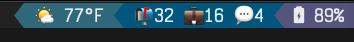

# Email Indicators

Gmail unread count indicators to display in the tmux status bar. Caches values in json to be read
in as a tmux-powerline segment.



## Setup

1. **Set up Gmail API credentials:**
   - Go to Google Cloud Console
   - Create a project with Gmail API enabled
   - Create OAuth 2.0 credentials (Desktop app)

2. **Run initial auth:**
   ```bash
   bun run src/auth-url.ts & bun run src/auth-complete.ts
   ```
   This opens a browser for you to consent. The token is saved to `~/.config/email-indicators/`.

3. **Configure tmux-powerline:**
   - Add the `mailcount_gmail` segment to your theme

## Usage
```bash
bun run src/email-counts.ts
```
Outputs personal unread inbox count along with a custom label unread count.
